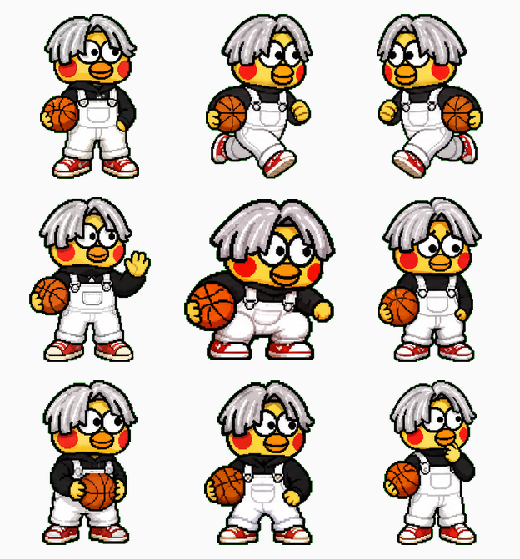

# 🐔 Kun Like 桌宠 - DSH 桌面宠物插件

<p align="center">
  
  
  
  
  
  <br>
  <a href="https://www.npmjs.com/package/dsh-kun-pet">npm 主页</a> ·
  <a href="https://github.com/Practice019/dsh-kun-like-pet">GitHub 仓库</a> ·
  <a href="#-一键安装静态插件">安装指南</a> ·
  <a href="#-常见问题">常见问题</a>
</p>

<p align="center">
  
</p>

<p align="center">
  <strong>DeepSeek Harness 桌面宠物插件</strong><br>
  Web 界面右下角的小坤宠，随 Agent 工作状态切换动作，任务完成时播放「你干嘛~哎哟」语音
</p>

<p align="center">
  
</p>

---

## 🎨 状态总览

<p align="center">
  
</p>

| 状态 | 触发条件 | 气泡文字 |
|------|----------|----------|
| 💤 idle | 空闲时 | 休息中~ 有事叫我 |
| 🔧 working | 工具执行中 | 努力工作中… |
| 🤔 review | 思考中 | 思考中… |
| ⏳ waiting | 等待用户回复 | 在等你回复哦~ |
| ❌ failed | 出错时 | 呜…出错了 (._.) |
| 🎉 celebrating | 任务完成 | 完成啦！你干嘛~哎哟 |
| 🏃 runRight/runLeft | 拖拽时 | 呜哇~ 别拽我！ |
| 👋 wave | 点击时 | 诶嘿~ |

---

## ✨ 功能特性

| 功能 | 说明 |
|------|------|
| 🎭 9种动画状态 | idle、working、review、waiting、failed、celebrating、runRight、runLeft、wave/jump |
| 🔊 单端语音播放 | 每个对话窗口停止输出时由 Host PowerShell 各播放一次（提问工具触发后不重复；多窗口各自触发，不依赖浏览器焦点） |
| 🖱️ 拖拽移动 | 按住桌宠拖动到任意位置 |
| 👆 点击互动 | 点击桌宠挥手打招呼 |

---

## 📦 一键安装（静态插件）

### 前置条件

- 已安装 [DeepSeek Harness (DSH)](https://github.com/deepseek-ai/dsh)
- 已安装 pnpm
- Windows 系统（需要 PowerShell）

### 安装命令

```bash
# 方式 1（推荐）：从 npm registry 一键安装
dsh plugin --profile web add dsh-kun-pet

# 方式 2：从 Git 仓库安装
dsh plugin --profile web add github:Practice019/dsh-kun-like-pet

# 方式 3：本地开发（link 模式，改代码重启即生效）
dsh plugin --profile web add ./dsh-kun-like-pet
```

安装后**重启 DSH** 即可，桌宠会自动出现在 Web 界面右下角，无需任何手动激活步骤。

### 更新插件

```bash
# 检查并更新到最新版本
dsh plugin update dsh-kun-pet
```

### 安装原理

```
dsh plugin add  →  pnpm 安装包
                →  识别 package.json 的 dsh.bundle.patch 声明
                →  自动加入 profile 的 bundles 列表
                →  识别 dsh.client 声明，注册浏览器端 bundle
重启 DSH        →  Host 端 (lib/index.js) 由 cordis.patch.yml 自动加载
                →  Client 端 (lib/client.js) 由浏览器模块表自动加载
```

### 卸载

```bash
dsh plugin --profile web remove dsh-kun-pet
```

---

## 🎮 使用说明

### 交互方式

- **拖拽**：按住桌宠拖动到任意位置
- **点击**：小鸡会挥手打招呼
- **任务完成**：自动播放「你干嘛~哎哟」语音

### 声音播放

- **任务完成**：Host 端 PowerShell 系统级播放（完整播放，等待播放结束才关闭；需要 Windows PresentationCore）；多窗口同时工作时，**每个窗口停止输出都会各自播放一次**
- **提问等回复**：AI 调用提问工具的瞬间立即播放；同一回合停止输出时不会重复播放
- **点击小鸡**：浏览器 Audio 即时播放（交互反馈）

---

## 🔧 技术架构

```
┌─────────────────────────────────────────────────────────────┐
│                      DSH Web 界面                           │
│  ┌─────────────────────────────────────────────────────┐   │
│  │                   shell.overlay 插槽                  │   │
│  │  ┌─────────────────────────────────────────────┐    │   │
│  │  │              KunPet 组件                      │    │   │
│  │  │  - 精灵图动画 (8列×9行)                       │    │   │
│  │  │  - 状态同步 (每400ms)                         │    │   │
│  │  │  - 拖拽/点击交互                              │    │   │
│  │  │  - 浏览器 Audio 播放声音                      │    │   │
│  │  └─────────────────────────────────────────────┘    │   │
│  └─────────────────────────────────────────────────────┘   │
└─────────────────────────────────────────────────────────────┘
                              │
                              │ fetch('/kun-pet/state') 每 400ms
                              ▼
┌─────────────────────────────────────────────────────────────┐
│                    DSH Host 进程                            │
│  ┌─────────────────────────────────────────────────────┐   │
│  │                   状态机                              │   │
│  │  - 轮询 agents.list() 每500ms                       │   │
│  │  - 监听 approval/request, tools/execute 事件        │   │
│  │  - 推导桌宠状态 (idle/working/review/celebrating)   │   │
│  └─────────────────────────────────────────────────────┘   │
│  ┌─────────────────────────────────────────────────────┐   │
│  │                   资源服务                            │   │
│  │  - /kun-pet/sprite.webp (精灵图)                    │   │
│  │  - /kun-pet/voice.mp3 (声音)                        │   │
│  │  - /kun-pet/state (状态 JSON)                       │   │
│  └─────────────────────────────────────────────────────┘   │
│  ┌─────────────────────────────────────────────────────┐   │
│  │              PowerShell 声音播放                      │   │
│  │  - 任务完成时系统级播放声音                          │   │
│  │  - 不依赖浏览器焦点                                  │   │
│  └─────────────────────────────────────────────────────┘   │
└─────────────────────────────────────────────────────────────┘
```

---

## 📁 文件结构

```
dsh-kun-like-pet/
├── package.json           ← DSH 插件声明 (dsh.bundle.patch + dsh.client)
├── cordis.patch.yml       ← Host 插件行（DSH 启动时自动加载）
├── README.md              ← 本文档
├── lib/
│   ├── index.js           ← Host 端代码（状态机 + 资源服务 + 声音播放）
│   └── client.js          ← Client 端 bundle（UI + 交互 + 浏览器声音播放）
├── assets/
│   ├── spritesheet.webp   ← 精灵图 (8列×9行, 192×208/格)
│   └── voice.mp3          ← 「你干嘛~哎哟」语音
├── docs/
│   ├── logo.png           ← README 主图（idle 第一帧）
│   ├── preview-sequence.png ← 动画序列帧预览
│   └── states.png         ← 9 种状态总览图
└── scripts/
    └── gen-docs-images.mjs ← 文档图片生成脚本
```

---

## 🐛 常见问题

### 1. 任务完成时没有声音

**原因**：PowerShell 播放失败（缺少 PresentationCore 程序集）或语音文件缺失

**解决方案**：
- 确认系统为 Windows（需要 PowerShell + WPF 运行时）
- 检查 `node_modules/dsh-kun-pet/assets/voice.mp3` 是否存在
- 手动测试：`powershell -c "Add-Type -AssemblyName PresentationCore; $p = New-Object System.Windows.Media.MediaPlayer; $p.Open([uri]'file:///D:/test/ai_study/dsh-kun-like-pet/assets/voice.mp3'); $p.Play(); Start-Sleep -Seconds 5"`

### 1b. 声音被截断 / 播放两次

**原因**：旧版本固定等待 3 秒导致长语音被截断；或双端同时播放

**解决方案**：
- 升级到 v1.0.0+（`lib/index.js` 等待 `NaturalDuration` 完整播放）
- 任务完成声音统一由 Host PowerShell 播放一次，Client 仅保留点击交互播放

### 2. 精灵图不显示

**原因**：资源文件读取失败，或 Host 插件未生效（`/kun-pet/state` 返回 HTML 而非 JSON）

**解决方案**：
- 检查 `node_modules/dsh-kun-pet/assets/` 目录是否存在精灵图文件
- 确认 Host 插件注入了 `webServer` 服务（`lib/index.js` 的 `inject: ['timer', 'webServer']`），否则启动早期服务未就绪时插件会静默退出
- 重启 DSH 后测试 `http://127.0.0.1:3080/kun-pet/state` 是否返回 JSON

### 3. 修改代码后不生效

**原因**：静态插件在 DSH 启动时加载

**解决方案**：修改 `lib/` 下代码后重启 DSH 生效

---

## 📝 开发说明

### 精灵图规格

- 格式：WebP
- 布局：8 列 × 9 行
- 每格尺寸：192 × 208 像素
- 总尺寸：1536 × 1872 像素

### 状态对应

| 行号 | 状态 | 帧数 |
|------|------|------|
| 0 | idle | 6 |
| 1 | runRight | 8 |
| 2 | runLeft | 8 |
| 3 | wave | 4 |
| 4 | jump | 5 |
| 5 | failed | 8 |
| 6 | waiting | 6 |
| 7 | working | 6 |
| 8 | review | 6 |

---

## 📄 许可证

MIT License

---

<p align="center">
  Made with ❤️ for DSH users
</p>
